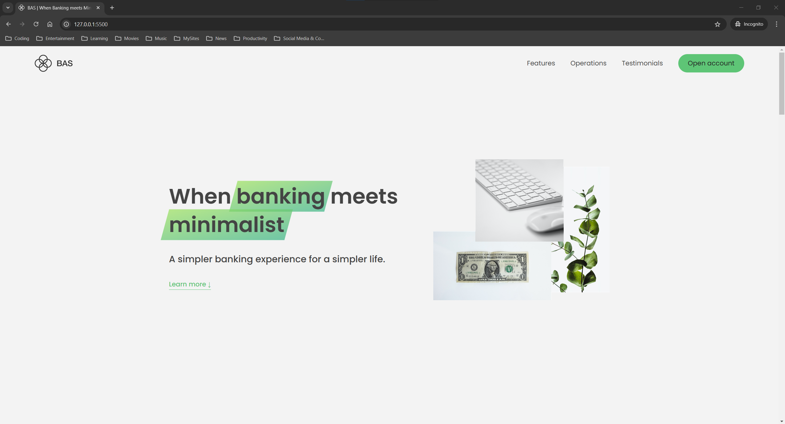

# Bank Account Simulator Website

This website serves as a polished showcase for the Bank Account Simulator app, providing visitors with an overview of the app features, benefits, and an introduction to its key functionalities. Built with a clean, modern aesthetic, the presentation site highlights how the app enables users to manage multiple bank accounts securely and efficiently.

[Take a live look at my website powered by Vercel](https://bank-account-simulator-website.vercel.app/)



## Features

- **Sleek and Minimalistic Design** - Crafted with simplicity and elegance, the site features a clean, unobtrusive aesthetic that enhances the user experience without distractions.
- **Intuitive and User-Friendly** - Designed for ease of use, every detail is thoughtfully arranged, allowing users to navigate seamlessly and find information effortlessly.
- **Informative and Well-Organized** - Each section is structured to communicate the app’s features clearly and concisely, ensuring users understand the app's capabilities at a glance.
- **Visually Engaging** - Combining minimalism with visual appeal, the layout is attractive yet functional, guiding the user’s attention smoothly through the content.

## Usage

### Prerequisites

Clone the repository via Git:

```bash
git clone https://github.com/edg96/BankAccountSimulatorWebsite
```

## A Long Advice

This project highlights the importance of web development fundamentals in creating dynamic, interactive web applications:

- HTML defines the structure and organization of the website’s content

- CSS styles the layout, ensuring a responsive and visually engaging design

- JavaScript adds interactivity and handles data dynamically, allowing actions such as logging in, transferring funds, and more

This project is ideal for those wanting to strengthen their skills in web development essentials (HTML, CSS, and JavaScript) while incorporating data handling and real-time updates.
